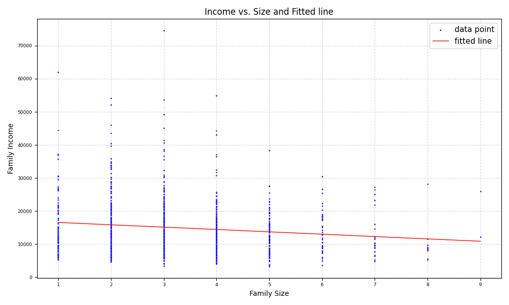

# Income Per-Person Estimator Analysis: Bootstrap, Jackknife, and Cross-Validation

Estimation of the mean income per person from a household data set `income` using three complementary approaches: bootstrap variance estimation of two rival estimators, jackknife variance and bias estimation, and cross-validation for polynomial model selection — all implemented in Python with NumPy and Matplotlib.

## Problem Statement

The `income` dataset contains two columns: household size (F-Size) and combined household income (F-Income). The goal is to estimate the mean income per person via two approaches:

- Estimator 1: `mean(Income / Size)`
- Estimator 2: `mean(Income) / mean(Size)`

**Part A:** Use the bootstrap to evaluate the variance of each estimator and determine which is better.  
**Part B:** Use the jackknife to evaluate the variance and bias of each estimator.  
**Part C:** Fit a polynomial regression between income $Y$ and household size $X$:

$$Y = a + bX + cX^2 + dX^3 + \cdots$$

Use cross-validation to select the polynomial degree with the smallest predictive error.

## Project Files

| File | Description |
|------|-------------|
| `incomePerPersonBootstrap.py` | Part A — Bootstrap variance estimation |
| `incomePerPersonJackknife.py` | Part B — Jackknife variance and bias estimation |
| `incomePerPersonCVPolyfit.py` | Part C — Polynomial fitting with cross-validation |
| `income.txt` | Input dataset (F-Size, F-Income columns) |
| `question.txt` | Text version of the assignment |
| `requirements.txt` | Python dependencies |
| `incomeVsSizeAndFittedLine.png` | Output plot: fitted polynomial curve |

## Method Summary

### Estimators

Let the sample be $\{(x_i, y_i)\}_{i=1}^n$ where $x_i$ = household size and $y_i$ = household income. Two estimators for per-capita income are defined on the full sample:

$$\hat{\theta}_1 = \frac{1}{n}\sum_{i=1}^{n}\frac{y_i}{x_i} \quad \text{(mean of ratios)}$$

$$\hat{\theta}_2 = \frac{\bar{Y}}{\bar{X}} = \frac{\frac{1}{n}\sum y_i}{\frac{1}{n}\sum x_i} \quad \text{(ratio of means)}$$

### A. Bootstrap

Draw $B = 100{,}000$ paired resamples $\{(x_i^* , y_i^* )\}_{i=1}^n$ with replacement (`seed=42`). For each resample $b$:

$$\hat{\theta}_k^{*(b)} = \text{estimator } k \text{ computed on resample } b, \quad k \in \{1, 2\}$$

Standard error and bias estimates:

$$
\widehat{\text{SE}} _ {\text{B}}(\hat{\theta}_ k) = \sqrt{\frac{1}{B-1}\sum_{b=1}^{B}\left(\hat{\theta}_k^{* (b)} - \bar{\theta}_k^{ * } \right)^2}, \qquad \bar{\theta}_ k^* = \frac{1}{B}\sum_{b=1}^{B}\hat{\theta}_k^{*(b)}
$$

$$\widehat{\text{Bias}}_{\text{B}}(\hat{\theta}_k) = \bar{\theta}_k^* - \hat{\theta}_k$$

### B. Jackknife (Quenouille–Tukey)

Let $\hat{\theta}_ {k,(i)}$ denote estimator $k$ computed on the leave-one-out sample $\{(x_j, y_j)\}_{j \ne i}$, and define the jackknife mean:

$$\bar{\theta}_{k,(\cdot)} = \frac{1}{n}\sum_{i=1}^{n}\hat{\theta}_{k,(i)}$$

Standard error and bias:

$$\widehat{\text{SE}}_{\text{J}}(\hat{\theta}_k) = \sqrt{\frac{n-1}{n}\sum_{i=1}^{n}\left(\hat{\theta}_{k,(i)} - \bar{\theta}_{k,(\cdot)}\right)^2}$$

$$\widehat{\text{Bias}}_{\text{J}}(\hat{\theta}_k) = (n-1)\left(\bar{\theta}_{k,(\cdot)} - \hat{\theta}_k\right)$$

### C. Leave-One-Out Cross-Validation (LOO-CV)

For each $i$, fit a degree- $d$ polynomial $\hat{f}^{(-i)}(x)$ on $\{(x_j, y_j)\}_{j \ne i}$ (via `np.polyfit`) and predict at $x_i$:

$$\hat{y}_i^{(-i)} = \hat{f}^{(-i)}(x_i)$$

LOO-CV mean squared error:

$$\text{CV-MSE}(d) = \frac{1}{n}\sum_{i=1}^{n}\left(y_i - \hat{y}_i^{(-i)}\right)^2$$

The optimal degree $d^*$ minimizes $\text{CV-MSE}(d)$.


## Requirements
```
pip install -r requirements.txt
```

## How to Run

```
python incomePerPersonBootstrap.py
python incomePerPersonJackknife.py
python incomePerPersonCVPolyfit.py
```

## Output

**Terminal output:**

**A- Bootstrap:**

- First estimator $\hat{\theta}_1 = \text{Mean}(I/S)$ and second estimator $\hat{\theta}_2 = \text{Mean}(I)/\text{Mean}(S)$
- Bootstrap variance of $\hat{\theta}_1$ & Bootstrap variance of $\hat{\theta}_2$
- Preferred estimator based on lower bootstrap variance

**B- Jackknife:**

- First estimator $\hat{\theta}_1 = \text{Mean}(I/S)$ and second estimator $\hat{\theta}_2 = \text{Mean}(I)/\text{Mean}(S)$
- Jackknife variance of $\hat{\theta}_1$ & Jackknife variance of $\hat{\theta}_2$
- Bias of $\hat{\theta}_1$ & Bias of $\hat{\theta}_2$

**C- Cross-Validation (LOO-CV):**

- Polynomial degrees tested: 1 through 5
- For each degree: LOO-CV MSE estimate
- Best polynomial degree selected based on minimum LOO-CV MSE

## Sample Output

### Fitted Curve



## Notes

- All scripts use `seed=42` for reproducibility.
- This project was developed as part of an academic exercise in statistical inference, covering resampling methods and model selection for uncertainty analysis in engineering applications.
